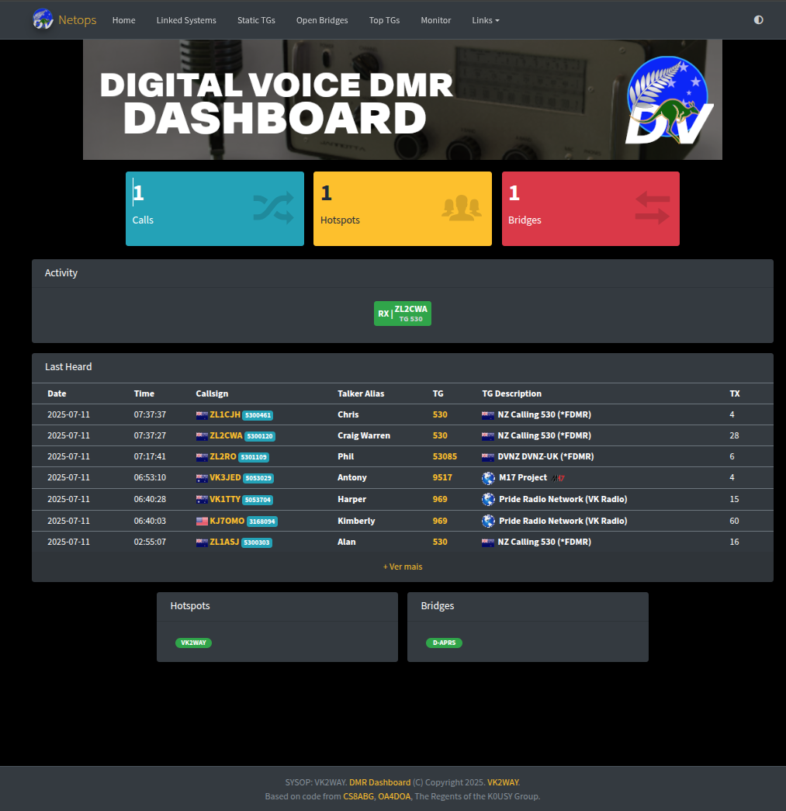

**Dashboard for Digital Voice DMR Servers**



Project lineage:

* FDMR Monitor for FreeDMR Server  https://github.com/cs8abg/FDMR-Monitor 
* FDMR Monitor for FreeDMR Server based on HBMonv2 https://github.com/yuvelq/FDMR-Monitor 
* HBMonitor v2 for DMR Server based on HBlink/FreeDMR https://github.com/sp2ong/HBMonv2 
* Python 3 implementation of N0MJS HBmonitor for HBlink https://github.com/kc1awv/hbmonitor3 

## Significant Changes

There have been significant changes from the cs8abg version:

* Websocket server is now a Web/Websocket server (python twisted)
* PHP Code entirely deprecated; templates now served by python twisted web.
* Translations have been removed in order to properly implemenet.

## Installation

Docker containers are the only supported installation method for the Digital Voice
DMR stack.

Instructions for installing a master server, bridges and dashboards can be found at the Digital Voice DMR setup guides at https://dvdmr.org/docs/

## Example docker-compose

```

version: '2.4' 
services:

    monitor:
        container_name: monitor
        image: 'docker.dvdmr.org/digitalvoice/monitor:latest'
        restart: "unless-stopped"
        volumes:
            - '/data/master/:/config'
            - '/data/master/:/data'
            - '/data/master/custom:/mon/custom'
            - '/data/log/:/log'
        ports:
          - 9000:9000/tcp
        environment:
          - MONITOR_CONFIG=/config/mon.cfg
```

* Configuration can be mounted anywhere but is expected in `/config/mon.cfg` by default.
* Data is stored in the `/data` mount by default, which can be over-ridden in mon.cfg.
* Logging is stored in the `/log` mount by default, which can be over-ridden in mon.cfg.
* Custom images and CSS are found in the `/mon/custom` mount

## nginx Configuration

Example nginx configuration

```
upstream noc-master-backend {
        server 127.0.0.1:9000;
}

server {
        server_name master.noc.dvdmr.org;

        location / {
            proxy_pass http://noc-master-backend/;
            proxy_http_version 1.1;
            proxy_set_header Upgrade $http_upgrade;
            proxy_set_header Connection $connection_upgrade;
        }
}
```


## Flags

***Flags have been introduced to add visual indicators for Talkgroups (TG) or DMR IDs. To enable flags for specific TGs or DMR IDs, follow these steps:***

- If you see the world flag flickering in the `lastheard`, `Linked systems`, etc. tables, you need to add or copy a new flag image in the `flags` folder.
- The flag image should be named with the first three digits of the Talkgroup or DMR ID.
- For example, if the Talkgroup is 12345678, place a file called `123.png` in the `flags` folder.

## Repeaters, Hotspots, and Bridges

***The dashboard now distinguishes between Repeaters, Hotspots, and Bridges based on their DMR IDs and/or TX/RX frequency.***

- If a DMR ID has 6 digits, it is considered a Repeater and will be displayed in the `Repeaters` table.
- If a DMR ID has 7 digits or more and has a TX/RX frequency associated with it, it is recognized as a Hotspot and will be shown in the `Hotspots` table.
- If a DMR ID has 7 digits or more and has a TX/RX frequency of 0 (zero), it is identified as a Bridge and will appear in the `Bridges` table.


---

